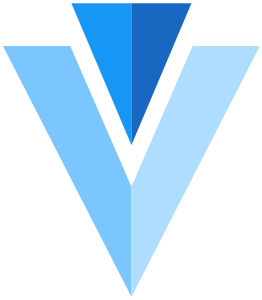

Awesome UIKit
===

Collect JS Frameworks, Web components library and Admin Template.

         

Contents
---

- [Frameworks](#frameworks)
  - [The Big Three](#the-big-three)
  - [Historically Significant](#historically-significant)
  - [Notable](#notable)
  - [Mobile](#mobile)
  - [Wechat](#wechat)
  - [Rest of the Pack](#rest-of-the-pack)
- [UI Components](#ui-components)
  - [React](#react)
  - [React Native](#react-native)
  - [Vue](#vue)
  - [Angular](#angular)
  - [San](#san)
  - [Mithril](#mithril)
  - [All In](#all-in)
  - [Tradition](#tradition)
- [Mobile UI Components](#mobile-ui-components)
  - [React](#react-1)
  - [React Native](#react-native)
  - [Vue](#vue-1)
  - [Wechat](#wechat-1)
  - [Tradition](#tradition-1)
- [Admin Template](#admin-template)
  - [React](#react-2)
  - [Vue](#vue-2)
  - [Angular](#angular-1)
  - [Other](#other)

**Explanation**

![Open-Source Software][OSS Icon] means **open source**, click to enter **open source** repo;   
![hot][hot Icon] means **hot**;  

## Frameworks

Most of this comes from: [The Ultimate Guide to JavaScript Frameworks](https://javascriptreport.com/the-ultimate-guide-to-javascript-frameworks/)

### The Big Three

- [React](https://reactjs.org/)  - A JavaScript library for building user interfaces. [![Open-Source Software][OSS Icon]](https://github.com/facebook/react)
- [Angular](https://angular.io/)  - One framework. Mobile & desktop. [![Open-Source Software][OSS Icon]](https://github.com/angular/angular)
- [Vue.js](https://vuejs.org/)  - A progressive, incrementally-adoptable JavaScript framework for building UI on the web. [![Open-Source Software][OSS Icon]](https://github.com/vuejs/vue)

### Historically Significant

- [AngularJS](https://angularjs.org)  - AngularJS - HTML enhanced for web apps! [![Open-Source Software][OSS Icon]](https://github.com/angular/angular.js)
- [Backbone](http://backbonejs.org/)  - Give your JS App some Backbone with Models, Views, Collections, and Events. [![Open-Source Software][OSS Icon]](https://github.com/jashkenas/backbone/)
- [Ember](https://www.emberjs.com/)  - A JavaScript framework for creating ambitious web applications. [![Open-Source Software][OSS Icon]](https://github.com/emberjs/ember.js)

### Notable

- [Aurelia](http://aurelia.io/)  - Aurelia allows us to focus on business logic, not on the framework. [![Open-Source Software][OSS Icon]](https://github.com/aurelia)
- [anu](https://rubylouvre.github.io/anu/)  - he React16-compat mini library. [![Open-Source Software][OSS Icon]](https://github.com/RubyLouvre/anu)
- [Elm](http://elm-lang.org/)  - Server and client code for the Elm website. [![Open-Source Software][OSS Icon]](https://github.com/elm/core)  
- [HTM](https://github.com/developit/htm)  - JSX alternative using standard tagged templates, with compiler support. [![Open-Source Software][OSS Icon]](https://github.com/developit/htm)
- [Inferno](https://infernojs.org/)  - An extremely fast, React-like JavaScript library for building modern user interfaces. [![Open-Source Software][OSS Icon]](https://github.com/infernojs/inferno) ![hot][hot Icon]
- [Polymer](https://www.polymer-project.org/)  - Build modern apps using web components. [![Open-Source Software][OSS Icon]](https://github.com/Polymer/polymer)
- [Preact](https://preactjs.com/)  - Fast 3kB React alternative with the same modern API. Components & Virtual DOM. [![Open-Source Software][OSS Icon]](https://github.com/developit/preact/)
- [ReasonML](https://reasonml.github.io/)  - Simple, fast & type safe code that leverages the JavaScript & OCaml ecosystems. [![Open-Source Software][OSS Icon]](https://github.com/facebook/reason)
- [Svelte](https://svelte.technology)  - The magical disappearing UI framework. [![Open-Source Software][OSS Icon]](https://github.com/sveltejs/svelte) ![hot][hot Icon]

### Mobile

- [nativescript-vue](https://nativescript-vue.org/)  - NativeScript with the ease of Vue. [![Open-Source Software][OSS Icon]](https://github.com/nativescript-vue/nativescript-vue)
- [react-native](http://facebook.github.io/react-native/)  - A framework for building native apps with React. [![Open-Source Software][OSS Icon]](https://github.com/facebook/react-native) ![hot][hot Icon]
- [Weex](https://weex.apache.org/)  - A framework for building Mobile cross-platform UI. [![Open-Source Software][OSS Icon]](https://github.com/apache/incubator-weex)

### Wechat

- [alita](https://areslabs.github.io/alita)  - 把 React Native 代码转换成微信小程序代码的转换引擎工具。 [![Open-Source Software][OSS Icon]](https://github.com/skyFi/weapp-native)
- [Antmove](https://ant-move.github.io/website/)  - 编译型跨端解决方案，基于支付宝/微信小程序，轻松地转换成其它平台的小程序。 [![Open-Source Software][OSS Icon]](https://github.com/ant-move/Antmove)
- [Anna Remax UI](https://ant-move.github.io/website/)  - 一款基于 Remax 框架开发的小程序 UI 组件库。 [![Open-Source Software][OSS Icon]](https://github.com/AnnaSearl/anna-remax-ui)
- [mpx](https://didi.github.io/mpx/)  - 滴滴开源小程序框架。 [![Open-Source Software][OSS Icon]](https://github.com/didi/mpx)
- [mpvue](http://mpvue.com)  - 基于 Vue.js 的小程序开发框架，从底层支持 Vue.js 语法和构建工具体系。 [![Open-Source Software][OSS Icon]](https://github.com/Meituan-Dianping/mpvue)
- [taro](https://taro.jd.com/)  - 多端统一开发框架，支持小程序、H5、React Native 等的应用。[![Open-Source Software][OSS Icon]](https://github.com/NervJS/taro)
- [weapp-native](https://github.com/skyFi/weapp-native)  - 像 React 组件开发一样来开发微信小程序，开发微信小程序框架。 [![Open-Source Software][OSS Icon]](https://github.com/skyFi/weapp-native)
- [wepy](https://tencent.github.io/wepy/)  - 小程序组件化开发框架。 [![Open-Source Software][OSS Icon]](https://github.com/Tencent/wepy)
- [Remax](https://remaxjs.org)  - 将 React 运行在小程序环境中，让你可以使用完整的 React 进行开发。 [![Open-Source Software][OSS Icon]](https://github.com/remaxjs/remax)

### Rest of the Pack

- [AppRun](https://yysun.github.com/apprun)  - AppRun is a developing applications using the elm architecture, events and components. [![Open-Source Software][OSS Icon]](https://github.com/yysun/apprun)
- [Atomico](https://github.com/UpperCod/Atomico)  - A small(1.6kB) library to work with web components. [![Open-Source Software][OSS Icon]](https://github.com/UpperCod/Atomico)
- [Binding.scala](https://github.com/ThoughtWorksInc/Binding.scala)  - Reactive data-binding for Scala. [![Open-Source Software][OSS Icon]](https://github.com/ThoughtWorksInc/Binding.scala)
- [avalon](http://avalonjs.coding.me/)  - An elegant efficient express mvvm framework. [![Open-Source Software][OSS Icon]](https://github.com/RubyLouvre/avalon)
- [Bobril](http://bobril.com/)  - Component oriented framework inspired by Mithril and ReactJs (already usable). [![Open-Source Software][OSS Icon]](https://github.com/Bobris/Bobril) ![hot][hot Icon]
- [Choo](https://choo.io/)  - sturdy 4kb frontend framework. [![Open-Source Software][OSS Icon]](https://github.com/choojs/choo)
- [Cycle.js](https://cycle.js.org/)  - A functional and reactive JavaScript framework for predictable code. [![Open-Source Software][OSS Icon]](https://github.com/cyclejs/cyclejs)
- [DIO](https://dio.js.org/)  - a library for building user interfaces. [![Open-Source Software][OSS Icon]](https://github.com/thysultan/dio.js) ![hot][hot Icon]
- [Dojo](https://dojo.io/)  - meta information for the project. [![Open-Source Software][OSS Icon]](https://github.com/dojo/meta)
- [Domvm](http://leeoniya.github.io/domvm/)  - DOM ViewModel - A thin, fast, dependency-free vdom view layer. [![Open-Source Software][OSS Icon]](https://github.com/leeoniya/domvm) ![hot][hot Icon]
- [dva](https://github.com/dvajs/dva)  -  React and redux based, lightweight and elm-style framework. [![Open-Source Software][OSS Icon]](https://github.com/dvajs/dva)
- [Etch](https://github.com/atom/etch)  - Builds components using a simple and explicit API around virtual-dom. [![Open-Source Software][OSS Icon]](https://github.com/atom/etch)
- [esx](http://elm-lang.org/)  - Like JSX, but native and fast. [![Open-Source Software][OSS Icon]](https://github.com/esxjs/esx)  
- [Gruu](https://gruujs.com/)  - JavaScript library for creating dynamic content. [![Open-Source Software][OSS Icon]](https://github.com/MarekLabuz/gruu)
- [Glimmer](https://glimmerjs.com/)  - Central repository for the Glimmer.js project. [![Open-Source Software][OSS Icon]](https://github.com/glimmerjs/glimmer.js)
- [Hyperapp](https://hyperapp.js.org/)  - 1 KB JavaScript library for building web applications. [![Open-Source Software][OSS Icon]](https://github.com/jorgebucaran/hyperapp) ![hot][hot Icon]
- [Hyperdom](https://github.com/featurist/hyperdom)  - A fast, feature rich and simple framework for building dynamic browser applications. [![Open-Source Software][OSS Icon]](https://github.com/featurist/hyperdom)
- [hyperHTML](https://viperhtml.js.org/)  - A Fast & Light Virtual DOM Alternative. [![Open-Source Software][OSS Icon]](https://github.com/WebReflection/hyperHTML)
- [Ivi](https://github.com/ivijs/ivi)  - Javascript (TypeScript) library for building web user interfaces. [![Open-Source Software][OSS Icon]](https://github.com/ivijs/ivi) ![hot][hot Icon]
- [Intact](https://javey.github.io/Intact)  - An inheritable and strong logic template front-end mvvm framework. [![Open-Source Software][OSS Icon]](https://github.com/Javey/Intact)
- [Knockout](http://knockoutjs.com/)  - Knockout makes it easier to create rich, responsive UIs with JavaScript. [![Open-Source Software][OSS Icon]](https://github.com/knockout/knockout)
- [Maquette](https://maquettejs.org/)  - Pure and simple virtual DOM library. [![Open-Source Software][OSS Icon]](https://github.com/AFASSoftware/maquette)
- [Marko](https://markojs.com/)  - A friendly (and fast!) UI library from eBay that makes building web apps fun. [![Open-Source Software][OSS Icon]](https://github.com/marko-js/marko)
- [Mithril](https://mithril.js.org/)  - A Javascript Framework for Building Brilliant Applications. [![Open-Source Software][OSS Icon]](https://github.com/MithrilJS/mithril.js)
- [Moon](http://moonjs.ga/)  - A minimal, blazing fast UI library. [![Open-Source Software][OSS Icon]](https://github.com/kbrsh/moon)
- [Maka.js](https://makajs.org)  - An inheritable and strong logic template front-end mvvm framework. [![Open-Source Software][OSS Icon]](https://github.com/makajs/maka)
- [Nerv](https://nerv.aotu.io/)  - A blazing fast React alternative, compatible with IE8 and React 16. [![Open-Source Software][OSS Icon]](https://github.com/NervJS/nerv)
- [NX](http://www.nx-framework.com/)  - A modular front-end framework - inspired by the server-side and Web Components. [![Open-Source Software][OSS Icon]](https://github.com/nx-js/framework)
- [petit-dom](https://github.com/yelouafi/petit-dom)  - minimalist virtual dom library. [![Open-Source Software][OSS Icon]](https://github.com/yelouafi/petit-dom) ![hot][hot Icon]
- [Picodom](https://github.com/picodom/picodom)  - 1 KB VDOM builder and patch function. [![Open-Source Software][OSS Icon]](https://github.com/picodom/picodom) ![hot][hot Icon]
- [Pux](http://purescript-pux.org/)  - Build type-safe web apps with PureScript. [![Open-Source Software][OSS Icon]](https://github.com/alexmingoia/purescript-pux/)
- [Ractive](https://ractive.js.org/)  - Next-generation DOM manipulation. [![Open-Source Software][OSS Icon]](https://github.com/ractivejs/ractive)
- [react-lite](https://github.com/Lucifier129/react-lite)  - an implementation of React that optimizes for small script size. [![Open-Source Software][OSS Icon]](https://github.com/Lucifier129/react-lite)
- [RE:DOM](https://redom.js.org/)  - Tiny (2 KB) turboboosted JavaScript library for creating user interfaces. [![Open-Source Software][OSS Icon]](https://github.com/redom/redom) ![hot][hot Icon]
- [Reflex](https://github.com/mozilla/reflex)  - Functional reactive UI library. [![Open-Source Software][OSS Icon]](https://github.com/mozilla/reflex)
- [Riot ](http://riotjs.com/)  - Simple and elegant component-based UI library. [![Open-Source Software][OSS Icon]](https://github.com/riot/riot)
- [rxdomh](https://github.com/xialvjun/rx-domh)  - Create DOM element and bind observables on it. [![Open-Source Software][OSS Icon]](https://github.com/xialvjun/rx-domh)
- [San](https://ecomfe.github.io/san/)  - A Flexible JavaScript Component Framework. [![Open-Source Software][OSS Icon]](https://github.com/ecomfe/san)
- [Simulacra.js](https://simulacra.js.org/)  - Data-binding function for the DOM. [![Open-Source Software][OSS Icon]](https://github.com/daliwali/simulacra)
- [Slim.js](http://slimjs.com)  - Fast & Robust Front-End Micro-framework based on modern standards. [![Open-Source Software][OSS Icon]](https://github.com/eavichay/slim.js)
- [STEM.JS](https://stemjs.org/)  - Another javascript framework. [![Open-Source Software][OSS Icon]](https://github.com/mciucu/stemjs)
- [Surplus](https://github.com/adamhaile/surplus)  - High performance JSX web views for S.js applications. [![Open-Source Software][OSS Icon]](https://github.com/adamhaile/surplus) ![hot][hot Icon]
- [Thermite](https://github.com/paf31/purescript-thermite)  - A simple PureScript wrapper for React. [![Open-Source Software][OSS Icon]](https://github.com/paf31/purescript-thermite)
- [TSERS](https://github.com/tsers-js/core)  - Transform-Signal-Executor framework for Reactive Streams. [![Open-Source Software][OSS Icon]](https://github.com/tsers-js/core)
- [Vidom](https://github.com/dfilatov/vidom)  - Library to build UI based on virtual DOM. [![Open-Source Software][OSS Icon]](https://github.com/dfilatov/vidom)
- [Vuera](https://github.com/akxcv/vuera)  - Vue in React, React in Vue. Seamless integration of the two. [![Open-Source Software][OSS Icon]](https://github.com/akxcv/vuera)

## UI Components

### React

* [React](https://github.com/facebook/react) based component library.*

- [uiw](http://uiwjs.github.io/)  - A high quality UI Toolkit, A Component Library for React. [![Open-Source Software][OSS Icon]](https://github.com/uiwjs/uiw)
- [ANT DESIGN](https://ant.design/index-cn)  - A UI Design Language. [![Open-Source Software][OSS Icon]](https://github.com/ant-design/ant-design)
- [Atlassian UI](https://atlaskit.atlassian.com/) Atlassian's official UI library, built according to the Atlassian Design Guidelines. [![Open-Source Software][OSS Icon]](https://bitbucket.org/atlassian/atlaskit-mk-2)
- [Amaze UI React](http://amazeui.org/react/)  - Amaze UI components built with React.js. [![Open-Source Software][OSS Icon]](https://github.com/amazeui/amazeui-react)
- [Arwes](https://arwes.dev)  - Futuristic Sci-Fi and Cyberpunk Graphical User Interface Framework for Web Apps. [![Open-Source Software][OSS Icon]](https://github.com/arwesjs/arwes)
- [Backpack](https://backpack.github.io)  - Backpack Design System. [![Open-Source Software][OSS Icon]](https://github.com/Skyscanner/backpack)
- [Base UI](https://baseweb.design)  - Base Web React Components. [![Open-Source Software][OSS Icon]](https://github.com/uber-web/baseui)
- [Blueprint](http://blueprintjs.com/)  - Blueprint is a React-based UI toolkit for the web. [![Open-Source Software][OSS Icon]](https://github.com/palantir/blueprint)
- [Bloom](https://bloom.appearhere.co.uk/)  - Bloom acts as a central repository for reuseable React components. [![Open-Source Software][OSS Icon]](https://github.com/appearhere/bloom)
- [Belle](http://nikgraf.github.io/belle/)  - Configurable React Components with great UX. [![Open-Source Software][OSS Icon]](https://github.com/nikgraf/belle)
- [Blue](https://github.com/helpscout/blue)  - A React UI Component Suites living for enterprise application. [![Open-Source Software][OSS Icon]](https://github.com/helpscout/blue)
- [Buttercup UI](https://buttercup.pw/)  - React UI Components used in Buttercup products. [![Open-Source Software][OSS Icon]](https://github.com/buttercup/ui)
- [Carbon](http://react.carbondesignsystem.com)  - React components according to IBM’s. [![Open-Source Software][OSS Icon]](https://github.com/IBM/carbon-components-react)
- [Chakra](https://chakra-ui.com)  - Simple, Modular & Accessible UI Components for your React Applications. [![Open-Source Software][OSS Icon]](https://github.com/chakra-ui/chakra-ui)
- [cloud-react](https://cloud-react.shuyun.com)  - 数云 PC端 react 基础组件。 [![Open-Source Software][OSS Icon]](https://github.com/ShuyunFF2E/cloud-react)
- [design-blocks](https://www.froala.com/design-blocks)  - React implementation for Froala Design Blocks. [![Open-Source Software][OSS Icon]](https://github.com/froala/react-froala-design-blocks)
- [Evergreen](https://segmentio.github.io/evergreen/)  - Evergreen React UI Framework by Segment. [![Open-Source Software][OSS Icon]](https://github.com/segmentio/evergreen)
- [Element React](https://elemefe.github.io/element-react/)  - A collection of essential UI components written with React. [![Open-Source Software][OSS Icon]](https://github.com/ElemeFE/element-react)
- [ExtReact](https://www.sencha.com/products/extreact/)  - Use Ext JS components in React. [![Open-Source Software][OSS Icon]](https://github.com/sencha/ext-react)
- [Fannypack](https://fannypack.style)  - A friendly, themeable, accessible React UI Kit built with Reakit. [![Open-Source Software][OSS Icon]](https://github.com/fannypackui/fannypack)
- [Foundation](https://react.foundation)  - Foundation as React components. [![Open-Source Software][OSS Icon]](https://github.com/nordsoftware/react-foundation)
- [Falcon UI](https://falcon-ui.docs.deity.io)  - A library of composable, themable, design-system-driven UI components for React. [![Open-Source Software][OSS Icon]](https://github.com/deity-io/falcon)
- [Fyndiq UI](https://fyndiq.github.io/fyndiq-ui)  -Library of reusable components for Fyndiq. [![Open-Source Software][OSS Icon]](https://github.com/fyndiq/fyndiq-ui)
- [Fusion Design](https://fusion.design/)  - A configurable component library for web built on React. [![Open-Source Software][OSS Icon]](https://github.com/alibaba-fusion/next)
- [Elemental UI](http://elemental-ui.com)  - A flexible and beautiful UI framework for React.js. [![Open-Source Software][OSS Icon]](https://github.com/elementalui/elemental)
- [Garden](https://garden.zendesk.com/react-components/)  - Garden React components based on garden css. [![Open-Source Software][OSS Icon]](https://github.com/zendeskgarden/react-components)
- [Gestalt](https://pinterest.github.io/gestalt/)  - A set of React UI components that supports Pinterest’s design language. [![Open-Source Software][OSS Icon]](https://github.com/pinterest/gestalt)
- [govuk-react](https://github.com/govuk-react/govuk-react/)  - An implementation of the GOV.UK Design System in React using CSSinJS. [![Open-Source Software][OSS Icon]](https://github.com/govuk-react/govuk-react)
- [Grommet](https://v2.grommet.io)  - Focus on the essential experience. [![Open-Source Software][OSS Icon]](https://github.com/grommet/grommet)
- [Hack Club Design System](https://design.hackclub.com)  - A react UIKit with nijigen style. [![Open-Source Software][OSS Icon]](https://github.com/hackclub/design-system)
- [hana-ui](https://hana-ui.moe)  - A react UIKit with nijigen style.  [![Open-Source Software][OSS Icon]](https://github.com/hana-group/hana-ui)
- [HIUI](https://xiaomi.github.io/hiui/)  This is a solution that is adequate for the fomulation and implementation of interaction and UI design standard for front, middle and backend. [![Open-Source Software][OSS Icon]](https://github.com/XiaoMi/hiui)
- [Instructure UI](https://instructure.design/)  - A UI Component Library made by Instructure, Inc. [![Open-Source Software][OSS Icon]](https://github.com/instructure/instructure-ui)
- [ICE DISIGN](https://alibaba.github.io/ice/)  - 海量可复用物料，通过 GUI 工具极速构建中后台应用. [![Open-Source Software][OSS Icon]](https://github.com/alibaba/ice)
- [Klarna UI](https://klarna.github.io/ui/)  - Klarna's UI components library. [![Open-Source Software][OSS Icon]](https://github.com/klarna/ui)
- [KhanAcademy React](http://khan.github.io/react-components/)  - Klarna's UI components library. [![Open-Source Software][OSS Icon]](https://github.com/Khan/react-components)
- [Material-UI](http://www.material-ui.com/#/)  - React components that implement Google's Material Design. [![Open-Source Software][OSS Icon]](https://github.com/callemall/material-ui)
- [Lodgify](https://lodgify.github.io/lodgify-ui/)  - React components for building amazing websites with Lodgify. [![Open-Source Software][OSS Icon]](https://github.com/lodgify/lodgify-ui)
- [Modul UI](https://brcportal2.github.io/modul-ui/)  - Modul UI React components. [![Open-Source Software][OSS Icon]](https://github.com/brcportal2/modul-ui)
- [MDBootstrap](https://mdbootstrap.com/docs/react/)  - React Bootstrap with Material Design. [![Open-Source Software][OSS Icon]](https://github.com/mdbootstrap/React-Bootstrap-with-Material-Design)
- [nice-react](https://nice.textkernel.nl/react/)  - React Bootstrap with Material Design. [![Open-Source Software][OSS Icon]](https://github.com/textkernel/nice-react)
- [Office UI Fabric](https://developer.microsoft.com/en-us/fabric)  - React components for building experiences for Office and Office 365. [![Open-Source Software][OSS Icon]](https://github.com/OfficeDev/office-ui-fabric-react)
- [Orbit](https://orbit.kiwi/)  - Public repository of Orbit Components of Kiwi.com. [![Open-Source Software][OSS Icon]](https://github.com/kiwicom/orbit-components)
- [oneui](https://textkernel.github.io/oneui/)  - Textkernel OneUI library of reusable UI components. [![Open-Source Software][OSS Icon]](https://github.com/textkernel/oneui)
- [PatternFly React](https://www.patternfly.org/)  - A set of React components for the PatternFly project. [![Open-Source Software][OSS Icon]](https://github.com/patternfly/patternfly-react)
- [Polaris React](https://polaris.shopify.com)  - Shopify’s product component library. [![Open-Source Software][OSS Icon]](https://github.com/Shopify/polaris)
- [Pivotal UI](https://styleguide.pivotal.io/)  - Pivotal UI is a collection of React components that are styled for the Pivotal brand. [![Open-Source Software][OSS Icon]](https://github.com/pivotal-cf/pivotal-ui)
- [Prime React](https://www.primefaces.org/primereact)  -  is a collection of rich UI components for React. [![Open-Source Software][OSS Icon]](https://github.com/primefaces/primereact)
- [Primer](https://primer.style/)  -  Primer React components. [![Open-Source Software][OSS Icon]](https://github.com/primer/components)
- [rbx](https://dfee.github.io/rbx/)  - The Comprehensive Bulma UI Framework for React. [![Open-Source Software][OSS Icon]](https://github.com/dfee/rbx)
- [reactjs-components](http://mesosphere.github.io/reactjs-components/)  - A library of reusable React components. [![Open-Source Software][OSS Icon]](https://github.com/mesosphere/reactjs-components)
- [Reakit](https://reakit.io/)  - Toolkit for building really interactive UIs with React. [![Open-Source Software][OSS Icon]](https://github.com/reakit/reakit)
- [RSUITE](https://rsuitejs.com/)  - A suite of React components . [![Open-Source Software][OSS Icon]](https://github.com/rsuite/rsuite)
- [React Material Web Components](https://jamesmfriedman.github.io/rmwc/)  - A collection of JetBrains Web UI components. [![Open-Source Software][OSS Icon]](https://github.com/jamesmfriedman/rmwc)
- [Ring UI](https://jetbrains.org/ring-ui/index.html)  - A collection of JetBrains Web UI components. [![Open-Source Software][OSS Icon]](https://github.com/JetBrains/ring-ui)
- [React UI](http://lobos.github.io/react-ui/)  - React Components，base on bootstrap 4.0. [![Open-Source Software][OSS Icon]](https://github.com/Lobos/react-ui)
- [React-Bootstrap](https://react-bootstrap.github.io/)  - The most popular front-end framework, rebuilt for React. [![Open-Source Software][OSS Icon]](https://github.com/react-bootstrap/react-bootstrap)
- [React Bootstrap](https://reactstrap.github.io)  - Simple React Bootstrap 4 components. [![Open-Source Software][OSS Icon]](https://github.com/reactstrap/reactstrap)
- [React Desktop](http://reactdesktop.js.org)  - React UI Components for macOS High Sierra and Windows 10. [![Open-Source Software][OSS Icon]](https://github.com/gabrielbull/react-desktop)
- [react-materialize](https://react-materialize.github.io)  - Material design for react, powered by materializecss. [![Open-Source Software][OSS Icon]](https://github.com/react-materialize/react-materialize)
- [React-md](https://react-md.mlaursen.com)  - 
React Material Design - React components built with sass. [![Open-Source Software][OSS Icon]](https://github.com/mlaursen/react-md)
- [React-Ionic](http://reactionic.github.io/)  - React Ionic: We are looking for a new maintainer! [![Open-Source Software][OSS Icon]](https://github.com/reactionic/reactionic)
- [React Responsive UI](https://catamphetamine.github.io/react-responsive-ui)  - Responsive React UI components! [![Open-Source Software][OSS Icon]](https://github.com/catamphetamine/react-responsive-ui)
- [React-WeUI](https://weui.github.io/react-weui/docs/)  - A collection of essential UI components written with React. [![Open-Source Software][OSS Icon]](https://github.com/weui/react-weui/)
- [React-UWP](https://www.react-uwp.com)  - React Components that Implement Microsoft's UWP Design & Fluent Design. [![Open-Source Software][OSS Icon]](https://github.com/reactionic/reactionic)
- [React Toolbox](http://react-toolbox.io)  - Is a set of React components that implement Google's Material Design specification. [![Open-Source Software][OSS Icon]](https://github.com/react-toolbox/react-toolbox)
- [Reach UI](https://ui.reach.tech)  - The Accessible Foundation for React Apps and Design Systems. [![Open-Source Software][OSS Icon]](https://github.com/reach/reach-ui)
- [Redition](https://balena-io-modules.github.io/rendition/)  - A library of React UI components. [![Open-Source Software][OSS Icon]](https://github.com/balena-io-modules/rendition)
- [Rebass](https://rebassjs.org/)  - Functional React UI component library, built with styled-components . [![Open-Source Software][OSS Icon]](https://github.com/rebassjs/rebass)
- [react-uikit-components](http://kbuechl.github.io/react-uikit-components/)  - React UIkit Components for the UIKit CSS framework. [![Open-Source Software][OSS Icon]](https://github.com/kbuechl/react-uikit-components)
- [Stardust UI](https://stardust-ui.github.io/react/)  - A themable React component library. [![Open-Source Software][OSS Icon]](https://github.com/stardust-ui/react)
- [Shineout](https://sheinsight.github.io/shineout)  - A components library for React. [![Open-Source Software][OSS Icon]](https://github.com/sheinsight/shineout)
- [Semantic UI](https://react.semantic-ui.com)  - The official Semantic-UI-React integration. [![Open-Source Software][OSS Icon]](https://github.com/Semantic-Org/Semantic-UI-React)
- [Smooth UI](https://smooth-ui.smooth-code.com/)  - Modern React UI library. Code less, do more.. [![Open-Source Software][OSS Icon]](https://github.com/smooth-code/smooth-ui)
- [UXCore](http://uxco.re/)  - A React UI Component Suites living for enterprise application. [![Open-Source Software][OSS Icon]](https://github.com/uxcore/uxcore)
- [tinper-bee](https://design.yonyoucloud.com/)  A component library based on the UI design language iUAP Design and React. [![Open-Source Software][OSS Icon]](https://github.com/iuap-design/tinper-bee)
- [Tenon-ui](https://tenon-ui.info/)  - Tenon accessible ui component library. [![Open-Source Software][OSS Icon]](https://github.com/tenon-io/tenon-ui)
- [Theme UI](https://theme-ui.com/)  - Build consistent, themeable React apps based on constraint-based design principles. [![Open-Source Software][OSS Icon]](https://github.com/system-ui/theme-ui)
- [Yoshino-UI](https://yoshino-ui.github.io)  - 一个基于react的可定制化的pc端组件库. [![Open-Source Software][OSS Icon]](https://github.com/Yoshino-UI/Yoshino)
- [Zent](https://www.youzanyun.com/zanui/zent)  - A collection of essential UI components written with React. [![Open-Source Software][OSS Icon]](https://github.com/youzan/zent)
- [Zero-UI](https://alphago88.github.io/Zero-UI/)  - An easy-to-use web UI component framework. [![Open-Source Software][OSS Icon]](https://github.com/AlphaGo88/Zero-UI)
- [Zarm Web](https://zarm-web.netlify.com/)  - Web UI component framework. [![Open-Source Software][OSS Icon]](https://github.com/JeromeLin/zarm-web)
- [zhui](https://zhui-team.github.io/zhui/)  - A Chinese style component library of react. [![Open-Source Software][OSS Icon]](https://github.com/zhui-team/zhui)

### Vue

* [Vue](https://github.com/vuejs/vue) based component library.*

- [Ant Design Vue](https://vuecomponent.github.io/ant-design-vue)  - Carbon design for VueJS. [![Open-Source Software][OSS Icon]](https://github.com/vueComponent/ant-design-vue)
- [at-ui](https://at.aotu.io)  - A fresh and flat UI-Kit specially for desktop application, made with ♥ by Vue.js 2.0. [![Open-Source Software][OSS Icon]](https://github.com/AT-UI/at-ui)
- [amaze-vue](https://smokingrabbit.github.io/amaze-vue/)  - UI Toolkit for Web, Vue2.0 .[![Open-Source Software][OSS Icon]](https://github.com/smokingRabbit/amaze-vue)
- [ATUI](https://aliqin.github.io/atui/)  - A Vue.js 2.0 UI Toolkit for Web. [![Open-Source Software][OSS Icon]](https://github.com/aliqin/atui)
- [Antue](https://zzuu666.github.io/antue/)  - A set of enterprise-class Vue UI components. [![Open-Source Software][OSS Icon]](https://github.com/zzuu666/antue)
- [bootstrap-vue](https://bootstrap-vue.github.io/)  - Implementation of [bootstrap-4](https://getbootstrap.com/) grid and components for Vue.js 2. [![Open-Source Software][OSS Icon]](https://github.com/bootstrap-vue/bootstrap-vue)
- [Buefy](https://buefy.github.io)  - Material Design UI library for Vuejs 2.0. [![Open-Source Software][OSS Icon]](https://github.com/rafaelpimpa/buefy)
- [BalmUI](https://material.balmjs.com/)  - Next Generation Material UI for Vue.js. [![Open-Source Software][OSS Icon]](https://github.com/balmjs/ui-vue)
- [Carvue.js](https://carvuejs.github.io/)  - Carbon design for VueJS. [![Open-Source Software][OSS Icon]](https://github.com/CarvueJS/carbon-components-vue)
- [Element](http://element.eleme.io/)  - A Vue.js 2.0 UI Toolkit for Web. [![Open-Source Software][OSS Icon]](https://github.com/ElemeFE/element)
- [Enterprise UI](https://ecomfe.github.io/veui/components/)  - Enterprise UI for Vue.js. [![Open-Source Software][OSS Icon]](https://github.com/ecomfe/veui)
- [fish-ui](https://myliang.github.io/fish-ui/)  - A Vue.js 2.0 UI Toolkit for Web. [![Open-Source Software][OSS Icon]](https://github.com/myliang/fish-ui)
- [gulu UI](https://frankfang.github.io/gulu/)  - 轱辘，面向源码阅读者的 UI 框架. [![Open-Source Software][OSS Icon]](https://github.com/FrankFang/gulu)
- [HeyUI](http://www.heyui.top/)  - UI Toolkit for Web, Vue2.0 . [![Open-Source Software][OSS Icon]](https://github.com/heyui/heyui)
- [iView](https://www.iviewui.com/)  - A high quality UI Toolkit based on Vue.js. [![Open-Source Software][OSS Icon]](https://github.com/iview/iview)
- [jsmod-pc-vue](https://github.com/chaogao/jsmod-pc-vue)  - high scalability && freedom vue ui components. [![Open-Source Software][OSS Icon]](https://github.com/chaogao/jsmod-pc-vue)
- [muse-ui](https://museui.github.io)  - Material Design UI library for Vuejs 2.0. [![Open-Source Software][OSS Icon]](https://github.com/museui/muse-ui)
- [Material Components Vue](https://matsp.github.io/material-components-vue/)  - Material Design components for Vue.js. [![Open-Source Software][OSS Icon]](https://github.com/matsp/material-components-vue)
- [N3-components](https://n3-components.github.io/N3-components/)  Powerful Vue UI Library.[![Open-Source Software][OSS Icon]](https://github.com/N3-components/N3-components)
- [owl-ui](https://owl-ui.dengwb.com)  - Mobile UI component library. [![Open-Source Software][OSS Icon]](https://github.com/dengwb1991/owl-ui)
- [PrimeVue](https://github.com/sudheerj/primevue)  - UI Components for Vue. [![Open-Source Software][OSS Icon]](https://github.com/sudheerj/primevue)
- [Quasar Framework](http://quasar-framework.org/)  - Material Component Framework for Vue.js 2. [![Open-Source Software][OSS Icon]](https://github.com/quasarframework/quasar)
- [Rubik UI](https://ccforward.github.io/rubik/#/)  - Material Design 风格的 Vue.js UI 组件库. [![Open-Source Software][OSS Icon]](https://github.com/ccforward/rubik)
- [Semantic UI Vue](https://semantic-ui-vue.github.io/#/)  - Semantic UI Vue is the Vue integration for Semantic UI. [![Open-Source Software][OSS Icon]](https://github.com/Semantic-UI-Vue/Semantic-UI-Vue)
- [UI](https://vuejs.github.io/ui/)  - UI components for official Vue organization apps. [![Open-Source Software][OSS Icon]](https://github.com/vuejs/ui)
- [Uiv](https://uiv.wxsm.space/)  - Is a Bootstrap 3 component library for Vue 2.. [![Open-Source Software][OSS Icon]](https://github.com/wxsms/uiv)
- [ui-vue-antd](https://aaronwn.github.io/vue-antd)  - Antd component library implemented with Vue. [![Open-Source Software][OSS Icon]](https://github.com/Aaronwn/ui-vue-antd)
- [vue-beauty](https://fe-driver.github.io/vue-beauty)  - Beautiful UI components build with vue and ant design. [![Open-Source Software][OSS Icon]](https://github.com/FE-Driver/vue-beauty)
- [vue-antd](https://vuecomponent.github.io/ant-design/docs/vue/introduce/)  - An enterprise-class UI components based on Ant Design 3.X and Vue. [![Open-Source Software][OSS Icon]](https://github.com/vueComponent/ant-design)
- [vue-material](http://vuematerial.io)  - Material design for Vue.js. [![Open-Source Software][OSS Icon]](https://github.com/vuematerial/vue-material)
- [vuesax](https://lusaxweb.github.io/vuesax/)  - Vuesax Frontend Vue Components. [![Open-Source Software][OSS Icon]](https://github.com/lusaxweb/vuesax)
- [vuetify](https://vuetifyjs.com)  - Material Component Framework for Vue.js 2. [![Open-Source Software][OSS Icon]](https://github.com/vuetifyjs/vuetify)
- [Vuikit](https://vuikit.js.org)  - UIkit with all the power of Vue. [![Open-Source Software][OSS Icon]](https://github.com/vuikit/vuikit)
- [vue-weui](http://adcentury.github.io/vue-weui/)  - WeUI Components with love of vue.js. [![Open-Source Software][OSS Icon]](https://github.com/adcentury/vue-weui)
- [vue-bulma-components](https://github.com/vouill/vue-bulma-components)  - Translate Bulma css api to vue components. [![Open-Source Software][OSS Icon]](https://github.com/vouill/vue-bulma-components)
- [v-semantic](https://github.com/eddow/v-semantic)  - Integration of [semantic-ui2](https://semantic-ui.com/) with vue.js2. [![Open-Source Software][OSS Icon]](https://github.com/eddow/v-semantic)
- [vue-mdc-adapter](https://stasson.github.io/vue-mdc-adapter/#/)  - Material Components for VueJS. [![Open-Source Software][OSS Icon]](https://github.com/stasson/vue-mdc-adapter)
- [vuecidity](https://vuecidity.wemakesites.net/) - UI component framework for Vue.js 2.0. [![Open-Source Software][OSS Icon]](https://bitbucket.org/acidmartin/vuecidity/)
- [vx-ui](http://vx.bittyos.com/)  - vue components. [![Open-Source Software][OSS Icon]](https://github.com/yunfeihuang/vx-ui)
- [vue-znl-ui](https://vitozyf.github.io/vue-znl-ui/)  - vue components. [![Open-Source Software][OSS Icon]](https://github.com/vitozyf/vue-znl-ui)
- [zircleUI](http://zircle.io)  - A circular zooming UI library. [![Open-Source Software][OSS Icon]](https://github.com/zircleUI/zircleUI)
- [xy-ui](https://xy-ui.codelabo.cn/docs)  - 面向未来的原生 web components UI组件库。 [![Open-Source Software][OSS Icon]](https://github.com/XboxYan/xy-ui)
- [zeit](https://zeit-vue.now.sh)  - Vue implementation for Zeit Style. [![Open-Source Software][OSS Icon]](https://github.com/zeit-ui/vue)

### Angular

* [Angular](https://github.com/angular/angular) based component library.*

- [Alyle UI](https://alyle-ui.firebaseapp.com)  - Minimal Design, a set of components for Angular. [![Open-Source Software][OSS Icon]](https://github.com/A-l-y-l-e/Alyle-UI)
- [Element Angular](https://element-angular.faas.ele.me)  - Element Design components built on top of Angular 2 [![Open-Source Software][OSS Icon]](https://github.com/ElemeFE/element-angular)
- [fuel-ui](http://fuelinteractive.github.io/fuel-ui/#/)  - Bootstrap 4 components and directives for use in Angular 2 [![Open-Source Software][OSS Icon]](https://github.com/FuelInteractive/fuel-ui)
- [Material](https://material.angular.io)  - Material Design components for Angular [![Open-Source Software][OSS Icon]](https://github.com/angular/material2)
- [ngOfficeUIFabric](http://ngofficeuifabric.com)  - A community-driven project that simplifies implementing Fabric in Angular-based apps [![Open-Source Software][OSS Icon]](https://github.com/ngOfficeUIFabric/ng-officeuifabric)
- [NG-ZORRO](https://ng.ant.design/docs/introduce/en)  - Ant Design of Angular [![Open-Source Software][OSS Icon]](https://github.com/NG-ZORRO/ng-zorro-antd)
- [ng2-bootstrap](https://valor-software.com/ngx-bootstrap/#/)  - Native Angular2 Bootstrap 3&4 components [![Open-Source Software][OSS Icon]](https://github.com/valor-software/ngx-bootstrap)
- [ng-lightning](http://ng-lightning.github.io/ng-lightning/)  - Native Angular 2 components & directives for Lightning Design System [![Open-Source Software][OSS Icon]](https://github.com/ng-lightning/ng-lightning)
- [ngSemantic](https://ng-semantic.herokuapp.com/#/)  - UI components based on Semantic UI [![Open-Source Software][OSS Icon]](https://github.com/vladotesanovic/ngSemantic)
- [ngx-ui](https://swimlane.github.io/ngx-ui)  - Style and Component Library for Angular2 and beyond! [![Open-Source Software][OSS Icon]](https://github.com/swimlane/ngx-ui)
- [ng-bootstrap](https://ng-bootstrap.github.io/#/home)  - Angular 4 directives for Bootstrap 4 by the ui-bootstrap team [![Open-Source Software][OSS Icon]](https://github.com/ng-bootstrap/ng-bootstrap)
- [prime-ng](https://www.primefaces.org/primeng/#/)  - Collection of rich UI components for Angular 2 [![Open-Source Software][OSS Icon]](https://github.com/primefaces/primeng)
- [Teradata covalent](https://teradata.github.io/covalent/#/)  - UI Platform built on @angular/material 2.0 [![Open-Source Software][OSS Icon]](https://github.com/Teradata/covalent)
- [telerik-angular](http://www.telerik.com/kendo-angular-ui/)  - Kendo UI for Angular. [![Open-Source Software][OSS Icon]](https://github.com/telerik/kendo-angular)
- [vmware clarity](https://vmware.github.io/clarity/)  - Mostly a CSS only framework but some components are ported to Angular 2 [![Open-Source Software][OSS Icon]](https://github.com/vmware/clarity)

### San

* [San](https://github.com/ecomfe/san) is a flexible JavaScript component framework*

- [san-mui](https://ecomfe.github.io/san-mui)  - A Set of SAN Components that Implement Google's Material Design [![Open-Source Software][OSS Icon]](https://github.com/ecomfe/san-mui)

### Mithril

- [Construct-UI](https://vrimar.github.io/construct-ui)  - A Mithril.js UI library. [![Open-Source Software][OSS Icon]](https://github.com/vrimar/construct-ui)
- [polythene](https://github.com/ArthurClemens/polythene)  - Material Design component library for Mithril and React [![Open-Source Software][OSS Icon]](https://github.com/ArthurClemens/polythene)

### All In

_Support [React](https://github.com/facebook/react), [Angular](https://github.com/angular/angular) and [Vue](https://github.com/vuejs/vue)_

- [Handsontable](https://handsontable.com/)  - JavaScript/HTML5 Data Grid Component with Spreadsheet Look & Feel [![Open-Source Software][OSS Icon]](https://github.com/handsontable/handsontable) 
- [MUI](https://www.muicss.com/)  - Lightweight CSS framework [![Open-Source Software][OSS Icon]](https://github.com/muicss/mui)
- [Onsen UI](https://onsen.io/)  - Mobile app development framework and SDK using HTML5 and JavaScript. [![Open-Source Software][OSS Icon]](https://github.com/OnsenUI/OnsenUI)
- [KPC](https://onsen.io/)  - A UI components library for Intact, Vue, React and Angular. [![Open-Source Software][OSS Icon]](https://github.com/ksc-fe/kpc)
- [storybook](https://storybook.js.org)  - Interactive UI component dev & test: React, React Native, Vue, Angular [![Open-Source Software][OSS Icon]](https://github.com/storybooks/storybook)

### Tradition

- [Bootstrap](http://getbootstrap.com)  - Create beautiful apps with modular and customizable UI components. [![Open-Source Software][OSS Icon]](https://github.com/twbs/bootstrap)
- [Bulma](https://purecss.io/)  - is a free and open source CSS framework based on Flexbox. [![Open-Source Software][OSS Icon]](https://github.com/jgthms/bulma)
- [bootflat](https://github.com/bootflat/bootflat.github.io)  - BOOTFLAT is an open source Flat UI KIT based on Bootstrap 3.3.0 CSS framework. [![Open-Source Software][OSS Icon]](https://github.com/bootflat/bootflat.github.io)
- [design-system](https://github.com/salesforce-ux/design-system)  - Salesforce Lightning Design System. [![Open-Source Software][OSS Icon]](https://github.com/salesforce-ux/design-system)
- [DXY-UI](https://dxy-f2e.github.io/dxy-ui/docs/)  - DXY-UI是一套适用于桌面端的前端UI库，不包含任何JS，仅仅关注样式。 [![Open-Source Software][OSS Icon]](https://github.com/jgthms/bulma)
- [LuLu](https://l-ui.com/)  - LuLu UI for PC web. [![Open-Source Software][OSS Icon]](https://github.com/yued-fe/lulu)
- [Layui](http://www.layui.com/)  - 一款采用自身模块规范编写的情怀型前端UI框架. [![Open-Source Software][OSS Icon]](https://github.com/sentsin/layui/)
- [Lit](https://ajusa.github.io/lit/)   - A ridiculously small responsive css framework. [![Open-Source Software][OSS Icon]](https://github.com/ajusa/lit)
- [Material](https://material.io)  - Create beautiful apps with modular and customizable UI components. [![Open-Source Software][OSS Icon]](https://github.com/material-components/material-components-web)
- [Metro 4](https://metroui.org.ua)  - Build responsive, mobile-first projects on the web with the first front-end component library in Metro Style. [![Open-Source Software][OSS Icon]](https://github.com/olton/Metro-UI-CSS)
- [MDUI](https://www.mdui.org/)  - 一套用于开发 Material Design 网页的前端框架。 [![Open-Source Software][OSS Icon]](https://github.com/zdhxiong/mdui)
- [moye](http://ecomfe.github.io/moye/)  - A Simple UI Library for ZX. [![Open-Source Software][OSS Icon]](https://github.com/ecomfe/moye)
- [NES.css](https://nostalgic-css.github.io/NES.css/)  - NES.css is NES-style (8bit-like) CSS Framework. [![Open-Source Software][OSS Icon]](https://github.com/nostalgic-css/NES.css)
- [Pure.css](https://purecss.io/)  - A set of small, responsive CSS modules that you can use in every web project. [![Open-Source Software][OSS Icon]](https://github.com/yahoo/pure)
- [photon](http://photonkit.com)  - The fastest way to build beautiful Electron apps using simple HTML and CSS. [![Open-Source Software][OSS Icon]](https://github.com/connors/photon)
- [PaperCSS](http://photonkit.com)  - The less formal CSS framework, with a quick and easy integration. [![Open-Source Software][OSS Icon]](https://github.com/papercss/papercss)
- [rui](https://github.com/r-ui/rui)  - 一个基于 Bootstrap 深度定制开源前端实践方案，帮助你快速构建现代跨屏应用。. [![Open-Source Software][OSS Icon]](https://github.com/r-ui/rui)
- [spectre](https://picturepan2.github.io/spectre/)  - A Lightweight, Responsive and Modern CSS Framework. [![Open-Source Software][OSS Icon]](https://github.com/picturepan2/spectre)
- [SUI](http://m.sui.taobao.org/)  - A framework based on the development of Framework7 UI library. [![Open-Source Software][OSS Icon]](https://github.com/sdc-alibaba/SUI-Mobile)
- [SuperUI](http://www.supermgr.cn/)  - 让体验变得如此完美，开发变得如此简单。 [![Open-Source Software][OSS Icon]](https://github.com/tzhsweet/superui)
- [Tabler](https://tabler.github.io)  -  is free and open-source HTML Dashboard UI Kit built on Bootstrap 4. [![Open-Source Software][OSS Icon]](https://github.com/tabler/tabler)
- [UIkit](https://getuikit.com/)  - A lightweight and modular front-end framework for developing fast and powerful web interfaces. [![Open-Source Software][OSS Icon]](https://github.com/uikit/uikit)
- [weui](https://weui.io/)  - tailor-made for WeChat web service. [![Open-Source Software][OSS Icon]](https://github.com/Tencent/weui)
- [ZUI](http://zui.sexy/)  - 一个基于 Bootstrap 深度定制开源前端实践方案，帮助你快速构建现代跨屏应用。. [![Open-Source Software][OSS Icon]](https://github.com/easysoft/zui)

## Mobile UI Components

### React

- [Auto-UI](https://aotuzuche.github.io/auto-ui/)  - Auto UI Web Components for mobile devices based on React. [![Open-Source Software][OSS Icon]](https://github.com/aotuzuche/auto-ui)
- [mazeui-touch](http://t.amazeui.org/)  - Web Components for mobile devices based on React. [![Open-Source Software][OSS Icon]](https://github.com/amazeui/amazeui-touch)
- [nowui](http://nowui.ivweb.io/)  - A React.js UI Toolkit for Web. [![Open-Source Software][OSS Icon]](https://github.com/iv-web/nowui)
- [Yo](https://ued.qunar.com/hy2/yo/index.html)  - Lightweight, easy-to-use, configurable, and extensible mobile front-end development framework.. [![Open-Source Software][OSS Icon]](https://github.com/doyoe/Yo)
- [yep-react](https://yep-react.jd.com/)  - yep react UI component. [![Open-Source Software][OSS Icon]](https://github.com/jdf2e/yep-react)
- [Zarm](https://zarm.gitee.io)  - 基于 React、React-Native 的移动端UI组件库 [![Open-Source Software][OSS Icon]](https://github.com/ZhongAnTech/zarm)

### React Native

Components for React Native applications

- [Ant Design Mobile](https://rn.mobile.ant.design/)  - Ant Design for React Native. [![Open-Source Software][OSS Icon]](https://github.com/ant-design/ant-design-mobile-rn)
- [blankapp/ui](http://blankapp.org/)  - Highly customizable and theming components for React Native. [![Open-Source Software][OSS Icon]](https://github.com/GeekyAnts/NativeBase)
- [carbon-native](http://getcarbonnative.com/)  - Essential cross-platform UI components for React Native. [![Open-Source Software][OSS Icon]](https://github.com/carbon-native/carbon-native)
- [kittenTricks](https://akveo.github.io/react-native-ui-kitten/)  - A react native mobile starter kit with over 40 screens and theme hot reload support. [![Open-Source Software][OSS Icon]](https://github.com/akveo/kittenTricks)
- [mCloud-Design-Mobile](https://troila-mobile.github.io/mCloud-Design-Mobile/)  - mCloud Design Mobile for React Native. [![Open-Source Software][OSS Icon]](https://github.com/troila-mobile/mCloud-Design-Mobile)
- [NativeBase](https://nativebase.io/)  - Essential cross-platform UI components for React Native. [![Open-Source Software][OSS Icon]](https://github.com/GeekyAnts/NativeBase)
- [Nachos UI](https://avocode.com/nachos-ui/)  - Nachos UI is a React Native component library.. [![Open-Source Software][OSS Icon]](https://github.com/avocode/nachos-ui)
- [Paper](https://callstack.github.io)  - Material design for React Native. [![Open-Source Software][OSS Icon]](https://github.com/callstack/react-native-paper)
- [panza](https://github.com/panza-org/panza)  - react-native stateless functional UI components to get you up and running quickly. [![Open-Source Software][OSS Icon]](https://github.com/panza-org/panza)
- [Rax](https://alibaba.github.io/rax)  - A universal React-compatible render engine. [![Open-Source Software][OSS Icon]](https://github.com/alibaba/rax)
- [react-native-ui-lib](https://github.com/wix/react-native-ui-lib)  - UI Components Library for React Native. [![Open-Source Software][OSS Icon]](https://github.com/wix/react-native-ui-lib)
- [react-native-ui-kitten](https://akveo.github.io/react-native-ui-kitten)  - Customizable and reusable react-native component kit. [![Open-Source Software][OSS Icon]](https://github.com/akveo/react-native-ui-kitten)
- [react-native-material-design](http://react-native-material-design.github.io/components/checkbox)  - React Native UI Components for Material Design. [![Open-Source Software][OSS Icon]](https://github.com/react-native-material-design/react-native-material-design)
- [rnx-ui](https://github.com/rnxteam/rnx-ui)  - A UI Lib for React Native. [![Open-Source Software][OSS Icon]](https://github.com/rnxteam/rnx-ui)
- [react-uikit](https://github.com/react-uikit/react-uikit)  - React and React Native components which implement Cards' Binary Design. [![Open-Source Software][OSS Icon]](https://github.com/react-uikit/react-uikit)
- [teaset](https://github.com/rilyu/teaset)  - A UI library for react native, provides 20+ pure JS(ES6) components. [![Open-Source Software][OSS Icon]](https://github.com/rilyu/teaset)
- [teaset](https://opensource-cards.github.io/binary-ui/)  - React and React Native components which implement Cards' Binary Design. [![Open-Source Software][OSS Icon]](https://github.com/opensource-cards/binary-ui)
- [Shoutem UI](https://shoutem.github.io)  - Customizable set of components for React Native applications. [![Open-Source Software][OSS Icon]](https://github.com/shoutem/ui)
- [SaltUI](https://salt-ui.github.io)  - SaltUI is a set of React UI components cooperated with DingTalk. [![Open-Source Software][OSS Icon]](https://github.com/salt-ui/saltui)

### Vue

- [cube-ui](https://didi.github.io/cube-ui/)  - A fantastic mobile ui lib implement by Vue.js. [![Open-Source Software][OSS Icon]](https://github.com/didi/cube-ui)
- [nutui](https://nutui.jd.com)  A Vue.js 2.0 UI Toolkit for Mobile Web.[![Open-Source Software][OSS Icon]](https://github.com/jdf2e/nutui)
- [ml-ui](http://www.zdliu.com/)  - A personal 基于 Vue 2.0 的 Mobile 组件库 ml-ui. [![Open-Source Software][OSS Icon]](https://github.com/zdliuccit/ml-ui)
- [Mand Mobile](https://didi.github.io/mand-mobile)  - A mobile UI toolkit, based on Vue.js 2, designed for financial scenarios.. [![Open-Source Software][OSS Icon]](https://github.com/didi/mand-mobile)
- [Mint UI](http://mint-ui.github.io/)  - A personal Vue UI component library for Mobile. [![Open-Source Software][OSS Icon]](https://github.com/ElemeFE/mint-ui)
- [Vue Carbon](http://www.myronliu.com/vue-carbon)  - Mobile UI Components Library based on Vue 2.0 at Weidian. [![Open-Source Software][OSS Icon]](https://github.com/myronliu347/vue-carbon)
- [vux](https://vux.li/)  - Mobile UI Components based on Vue & WeUI. [![Open-Source Software][OSS Icon]](https://github.com/airyland/vux)
- [Vusion](https://vusion.github.io/vusion-ui/)  - Vusion UI. [![Open-Source Software][OSS Icon]](https://github.com/vusion/vusion-ui)
- [Vant](https://youzan.github.io/vant/)  - A Vue.js 2.0 Mobile UI at YouZan. [![Open-Source Software][OSS Icon]](https://github.com/youzan/vant)
- [vue-ydui](http://vue.ydui.org/)  - A mobile components Library with Vue2.js. [![Open-Source Software][OSS Icon]](https://github.com/ydcss/vue-ydui)
- [WDUI](https://wdfe.github.io/wdui/#/)  - Mobile UI Components Library based on Vue 2.0 at Weidian. [![Open-Source Software][OSS Icon]](https://github.com/wdfe/wdui)
- [x-vui](https://brickies.github.io/vui/)  - A personal Vue UI component library for Mobile. [![Open-Source Software][OSS Icon]](https://github.com/Brickies/vui)

### Wechat

- [iview-weapp](https://weapp.iviewui.com/)  - 一套高质量的微信小程序 UI 组件库。[![Open-Source Software][OSS Icon]](https://github.com/TalkingData/iview-weapp)
- [kai-ui](https://chaunjie.github.io/kui/dist)  - 高颜值组件库，简单易用，同时支持原生和wepy框架。[![Open-Source Software][OSS Icon]](https://github.com/Chaunjie/kai-ui)
- [MinUI](https://meili.github.io/min/docs/minui/)  - Min 小程序组件化解决方案。[![Open-Source Software][OSS Icon]](https://github.com/meili/min-cli)
- [taro-ui](https://taro-ui.aotu.io)  - 一款基于 Taro 框架开发的多端 UI 组件库。[![Open-Source Software][OSS Icon]](https://github.com/NervJS/taro-ui)
- [wa-ui](https://github.com/liujians/wa-ui/wiki)  - 针对微信小程序整合的一套UI库。[![Open-Source Software][OSS Icon]](https://github.com/liujians/Wa-UI)
- [weui-wxss](https://github.com/Tencent/weui-wxss)  - WeUI for 小程序。 [![Open-Source Software][OSS Icon]](https://github.com/Tencent/weui-wxss)
- [weui-miniprogram](https://github.com/Tencent/weui-wxss)  - 小程序WeUI组件库。 [![Open-Source Software][OSS Icon]](https://github.com/wechat-miniprogram/weui-miniprogram)
- [Wuss Weapp](https://github.com/phonycode/wuss-weapp)  - 一款高质量，组件齐全，高自定义的微信小程序 UI 组件库。 [![Open-Source Software][OSS Icon]](https://github.com/phonycode/wuss-weapp)
- [wx-charts](https://github.com/xiaolin3303/wx-charts)  - 微信小程序图表charts组件，Charts for WeChat small app。[![Open-Source Software][OSS Icon]](https://github.com/xiaolin3303/wx-charts)
- [wemark](https://github.com/TooBug/wemark)  - 微信小程序Markdown渲染库。[![Open-Source Software][OSS Icon]](https://github.com/TooBug/wemark)
- [vant-weapp](https://youzan.github.io/vant-weapp)  - 高颜值、好用、易扩展的微信小程序 UI 库，Powered by 有赞。 [![Open-Source Software][OSS Icon]](https://github.com/youzan/vant-weapp)
- [zanui-weapp](https://github.com/youzan/zanui-weapp)  - 高颜值、好用、易扩展的微信小程序 UI 库，Powered by 有赞。 [![Open-Source Software][OSS Icon]](https://github.com/youzan/zanui-weapp)

### Tradition

- [AUI](http://www.auicss.com)  - 移动端UI快速布局解决方案，一个靠谱的高性能移动前端框架。 [![Open-Source Software][OSS Icon]](https://github.com/liulangnan/aui)
- [FrozenUI](http://frozenui.github.io)  - FrozenUI的CSS组件库，基于腾讯手Q样式规范，腾讯QXD出品。 [![Open-Source Software][OSS Icon]](https://github.com/frozenui/frozenui)
- [weui.js](https://weui.io)  - A lightweight javascript library for WeUI. [![Open-Source Software][OSS Icon]](https://github.com/Tencent/weui)

## Admin Template

### React

- [ant-design-pro](https://preview.pro.ant.design/)  - An out-of-box UI solution for enterprise applications. [![Open-Source Software][OSS Icon]](https://github.com/ant-design/ant-design-pro)
- [antd-admin](http://antd-admin.zuiidea.com/)  - A admin dashboard application demo built upon Ant Design and Dva.js. [![Open-Source Software][OSS Icon]](https://github.com/zuiidea/antd-admin)
- [admin-on-rest](https://marmelab.com/admin-on-rest-demo/)  - A frontend framework for building admin SPAs on top of REST services, using React and Material Design. [![Open-Source Software][OSS Icon]](https://github.com/marmelab/admin-on-rest)
- [react-antd-admin](http://jxy.me/react-antd-admin/)  - 用React和Ant Design搭建的一个通用管理后台. [![Open-Source Software][OSS Icon]](https://github.com/jiangxy/react-antd-admin)
- [react-antd](http://antd.sosout.com/home)  - 基于react + antd(1.x)实现的SPA后台管理系统模板. [![Open-Source Software][OSS Icon]](https://github.com/sosout/react-antd)
- [react-material-admin-template](https://rafaelhz.github.io/react-material-admin-template/)  - A simple responsive admin template using react and material-ui. [![Open-Source Software][OSS Icon]](https://github.com/rafaelhz/react-material-admin-template)
- [react-admin](http://cheng_haohao.oschina.io/reactadmin/#/app/ui/gallery)  - react-admin system solution. [![Open-Source Software][OSS Icon]](https://github.com/yezihaohao/react-admin)
- [Free Bootstrap Admin Template](http://coreui.io/demo/Ajax_Demo/)  - CoreUI is free bootstrap admin template with Angular2, AngularJS, React.js & Vue.js support. [![Open-Source Software][OSS Icon]](https://github.com/mrholek/CoreUI-Free-Bootstrap-Admin-Template)
- [reactSPA](https://muyunyun.github.io/reactSPA)  - 一个后台管理系统模板 [![Open-Source Software][OSS Icon]](https://github.com/MuYunyun/reactSPA)
- [rsuite-management-system](https://sample.rsuitejs.com/)  - A management system template based on React Suite. [![Open-Source Software][OSS Icon]](https://github.com/rsuite/rsuite-management-system)

### Vue

- [avue](https://github.com/nmxiaowei/avue)  - 一个类似easyui那种去写vue的方案支持SSR(服务端渲染)和SPA(单例页面)。 [![Open-Source Software][OSS Icon]](https://github.com/nmxiaowei/avue)
- [CoPilot](https://copilot.mistergf.io/)  - Responsive Bootstrap 3 Admin Template based on AdminLTE with vue.js. [![Open-Source Software][OSS Icon]](https://github.com/misterGF/CoPilot)
- [D2 Admin](https://d2admin.fairyever.com)  - An elegant dashboard. [![Open-Source Software][OSS Icon]](https://github.com/d2-projects/d2-admin)
- [Element UI Pro](https://qidaizhe11.github.io/element-pro/)  - Vue 版 Ant Design Pro（基于 Element-ui 实现）。[![Open-Source Software][OSS Icon]](https://github.com/qidaizhe11/element-pro)
- [Flow-UI](http://refined-x.com/Flow-UI/dashboard/index.html)  - 是一套组件化UI框架，支持定制主题，主要服务于前台及中后台产品。[![Open-Source Software][OSS Icon]](https://github.com/tower1229/Flow-UI)
- [iview-admin](https://iview.github.io/iview-admin)  - Vue 2.0 admin management system template based on iView. [![Open-Source Software][OSS Icon]](https://github.com/iview/iview-admin)
- [Keen-UI](https://josephuspaye.github.io/Keen-UI/)  - A lightweight collection of essential UI components written with Vue and inspired by Material Design. [![Open-Source Software][OSS Icon]](https://github.com/JosephusPaye/Keen-UI)
- [vue-element-admin](http://panjiachen.github.io/vue-element-admin/)  - vue2.0 admin / a management system template. [![Open-Source Software][OSS Icon]](https://github.com/PanJiaChen/vue-element-admin)
- [vue-admin](https://admin.vuebulma.com)  - Vue Admin Panel Framework, Powered by Vue 2.0 and Bulma 0.3. [![Open-Source Software][OSS Icon]](https://github.com/vue-bulma/vue-admin)
- [vue-admin](https://taylorchen709.github.io/vue-admin/)  - admin template based on vuejs2 and element. [![Open-Source Software][OSS Icon]](https://github.com/taylorchen709/vue-admin)
- [vuestic-admin](http://vuestic.epicmax.co/)  - Vue.js admin dashboard [![Open-Source Software][OSS Icon]](https://github.com/epicmaxco/vuestic-admin)
- [vue-framework-wz](http://herozhou.coding.me/vue-framework-wz)  - This project is a background management framework, integrated rights management, login function, industrial UI components, node-cli and other functions, it is recommended to use. [![Open-Source Software][OSS Icon]](https://github.com/herozhou/vue-framework-wz)
- [vue-quasar-admin-example](https://quasar-admin.firebaseapp.com/#/)  - Example of quasar admin. [![Open-Source Software][OSS Icon]](https://github.com/odranoelBR/vue-quasar-admin-example)
- [vue2-element-touzi-admin](https://github.com/wdlhao/vue2-element-touzi-admin)  - 基于vue2.0 +vuex+ element-ui后台管理系统。 [![Open-Source Software][OSS Icon]](https://github.com/wdlhao/vue2-element-touzi-admin)
- [vue-antd-pro](https://pro.loacg.com)  - Use Ant Design Vue like a Pro! [![Open-Source Software][OSS Icon]](https://github.com/sendya/ant-design-pro-vue)

### Angular

- [angular-material-dashboard](http://flatlogic.github.io/angular-material-dashboard)  - Angular admin dashboard with material design. [![Open-Source Software][OSS Icon]](https://github.com/flatlogic/angular-material-dashboard)
- [blur-admin](http://akveo.com/blur-admin-mint/#/dashboard)  - Angular Bootstrap Admin Panel Framework. [![Open-Source Software][OSS Icon]](https://github.com/akveo/blur-admin)
- [ng-alain](http://ng-alain.com/)  - ng-zorro-antd admin panel front-end framework. [![Open-Source Software][OSS Icon]](https://github.com/cipchk/ng-alain)
- [ngx-admin](http://akveo.com/ngx-admin)  - Admin dashboard template based on Angular 4+, Bootstrap 4. [![Open-Source Software][OSS Icon]](https://github.com/akveo/ngx-admin)
- [ng-admin](http://marmelab.com/ng-admin-demo)  - Add an AngularJS admin GUI to any RESTful API. [![Open-Source Software][OSS Icon]](https://github.com/marmelab/ng-admin)
- [rdash-angular](http://rdash.github.io/#)  - AngularJS implementation of the RDash admin dashboard theme. [![Open-Source Software][OSS Icon]](https://github.com/rdash/rdash-angular)

### Other

- [AdminLTE](https://adminlte.io/themes/AdminLTE/index2.html)  - AdminLTE - Free Premium Admin control Panel Theme Based On Bootstrap 3.x. [![Open-Source Software][OSS Icon]](https://github.com/almasaeed2010/AdminLTE)
- [ace](http://ace.jeka.by)  - Metis - Free Bootstrap Admin Dashboard Template. [![Open-Source Software][OSS Icon]](https://github.com/bopoda/ace)
- [Bootstrap-Admin-Template](https://colorlib.com/polygon/metis)  - Metis - Free Bootstrap Admin Dashboard Template. [![Open-Source Software][OSS Icon]](https://github.com/puikinsh/Bootstrap-Admin-Template)
- [Bootstrap-Admin-Theme](http://vinceg.github.io/Bootstrap-Admin-Theme)  - A generic admin theme built with Bootstrap free for both personal and commercial use. [![Open-Source Software][OSS Icon]](https://github.com/VinceG/Bootstrap-Admin-Theme)
- [Dashboard](https://github.com/twbs/bootstrap/tree/eda851ee76bd01375f39682d903a76cc51207475/site/docs/4.2/examples/dashboard)  - Dashboard Template for Bootstrap. [![Open-Source Software][OSS Icon]](https://github.com/twbs/bootstrap/tree/eda851ee76bd01375f39682d903a76cc51207475/site/docs/4.2/examples/dashboard)
- [dva-admin](https://pmg1989.github.io/login)  - dva admin antd dashboard . [![Open-Source Software][OSS Icon]](https://github.com/pmg1989/dva-admin)
- [flakes](http://getflakes.com/preview/dashboard.html)  - Flakes is an Admin Template Framework. A combination of CSS Libraries, JavaScript Libraries and Design files that help you build business tools very quickly. [![Open-Source Software][OSS Icon]](https://github.com/kumailht/flakes)
- [gentelella](https://colorlib.com/polygon/gentelella/index.html)  - Free Bootstrap 3 Admin Template. [![Open-Source Software][OSS Icon]](https://github.com/puikinsh/gentelella)
- [lumber](https://doc.forestadmin.com/developer-guide/lumber.html)  - The Admin Interface Framework. [![Open-Source Software][OSS Icon]](https://github.com/ForestAdmin/lumber)
- [Light Admin](https://trendytech.ru/templates/light-admin)  - Light Admin is a lightweight Bootstrap 3 admin panel template. [![Open-Source Software][OSS Icon]](https://github.com/sn8/light-admin-bs3)
- [Layuimini](http://layuimini.99php.cn/)  - 后台 admin 前端模板，基于 layui 编写的最简洁、易用的后台框架模板。 [![Open-Source Software][OSS Icon]](https://github.com/zhongshaofa/layuimini)
- [modular-admin-html](https://modularcode.io/modular-admin-html)  - The Admin Interface Framework. [![Open-Source Software][OSS Icon]](https://github.com/modularcode/modular-admin-html)
- [startbootstrap-sb-admin-2](https://blackrockdigital.github.io/startbootstrap-sb-admin-2/pages/index.html)  - A free, open source, Bootstrap admin theme created by Start Bootstrap. [![Open-Source Software][OSS Icon]](https://github.com/BlackrockDigital/startbootstrap-sb-admin-2)
- [Vali Admin](http://pratikborsadiya.in/vali-admin)  - Vali is a free, modular and easy to customize admin theme built using Bootstrap, SASS and Pug.js. [![Open-Source Software][OSS Icon]](https://github.com/pratikborsadiya/vali-admin)

[hot Icon]: https://jaywcjlove.github.io/sb/ico/min-hot.svg "Hot"
[OSS Icon]: https://jaywcjlove.github.io/sb/ico/min-oss.svg "Open source ui componet on Github"
